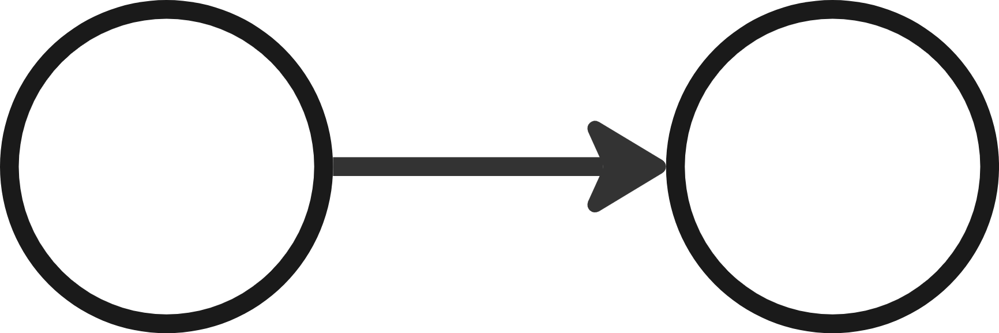
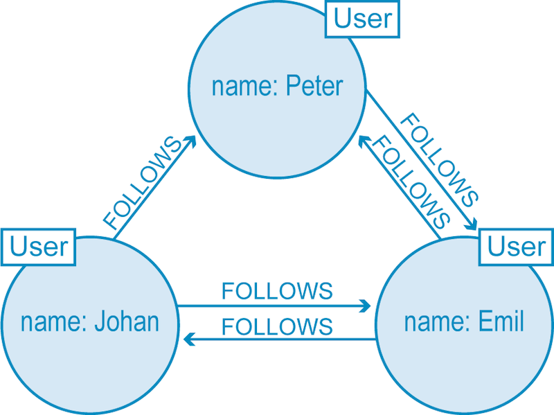

# Grafdatabaser

---

# Vad ska man välja?

|             | **Dokumentdatabas**       | **Grafdatabas**               | **Relationsdatabas**       |
|-------------|---------------------------|-------------------------------|----------------------------|
| **Vad**     | JSON-liknande dokument     | Noder och relationer         | Tabeller, rader, kolumner  |
| **Hur**     | Varierar (ex. MongoDB)     | Cypher (Neo4j)               | SQL                        |
| **Varför**  | Ostrukturerad data         | Nätverk, komplexa relationer | Struktur, integritet, transaktionstungt    |

---

## Grafdatabas, generellt

* DAG, directed acyclic graph
* Uppbyggnad
  - Noder, verticies
  - Kanter, relationer, edges
  - Oftast enkelriktade kanter, (från-till)
* 

---

## Typer av grafdatabaser

* Property-Based Grafdatabas
  - Noder och relationer 
  - Både kan ha en lista med egenskaper som nyckel-värde-par.
  - "NoSQL" schemaless

* Triple Store
  - Noder och relationer modelleras som (subjekt-predikat-objekt)
  - Semantiska webben, ontologier
  - Strikt, närmar sig prolog :fearful:
  - Inte i fokus!

---

## Property based, neo4j

* Labels, relationships, nodes, properties

---

